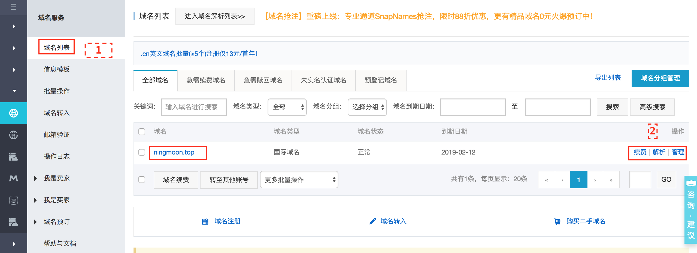
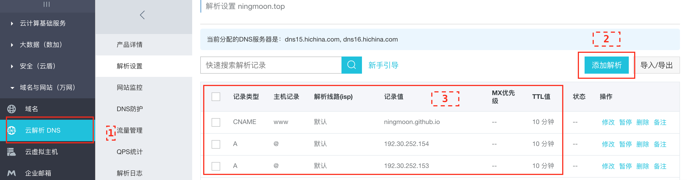

<!-- more -->

**本文介绍为你的GitHub博客设置专属域名**

在为你的GitHub博客设置专属域名的前提是你已经用GitHub打造了你的个人博客，如果还没有，可以参考上一篇文章。

为你的GitHub博客设置专属域名主要分为以下几步：
## 1 域名购买与解析
首先你要申请一个域名，因为毕竟xxx.github.io这个一长串的网址不好记，关于域名申请的话这里还是推荐[万网](https://wanwang.aliyun.com/)，查找你想申请域名，如果没有被占用，购买就可以了。

购买域名完成，进入万网的管理控制台：



找到你已经购买的域名，点击解析，进入如下页面：



点击添加解析，注意这里必须按照图中标注的添加这三条，2个A和一个www。

`这里需要注意的是有些域名是需要你在万网进行实名认证的，不然就算这里显示解析成功，万网也不会给你提供解析服务，所以还是有必要进行一下实名认证`


ok，设置完成解析之后，还不能直接访问域名就能跳转到我们的Github页面。

我们只差最后一步。

## 2 创建CNAME

只差一个CNAME文件，这个文件需要创建在我们的本地仓库主目录中的source目录下，可以通过各种方法创建一个没有后缀的名叫CNAME的文件，如果不会，可以参考下面的命令行来创建：
```python
$ cd source/     # 命令行进入source目录中
$ touch CNAME    #命令行创建一个叫CNAME的文件
$ vim CNAME      #用VIM打开刚刚创建的CNAME文件，并输入你的域名
$ git add CNAME  #这一步及以下两步是把更改内容推送至在线的GitHub中
$ git commit -m "add CNAME"
$ git push
```
到这里，不出意外你就已经可以通过你的域名访问了你的博客了，而你的博客也已经有了个性的专属域名。

ok，到这里你已经学会了如何通过你购买的域名与Github pages结合，即通过你购买的域名访问你的个人站点了。


