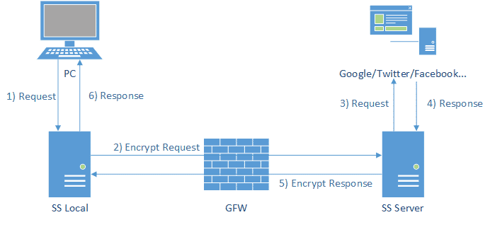
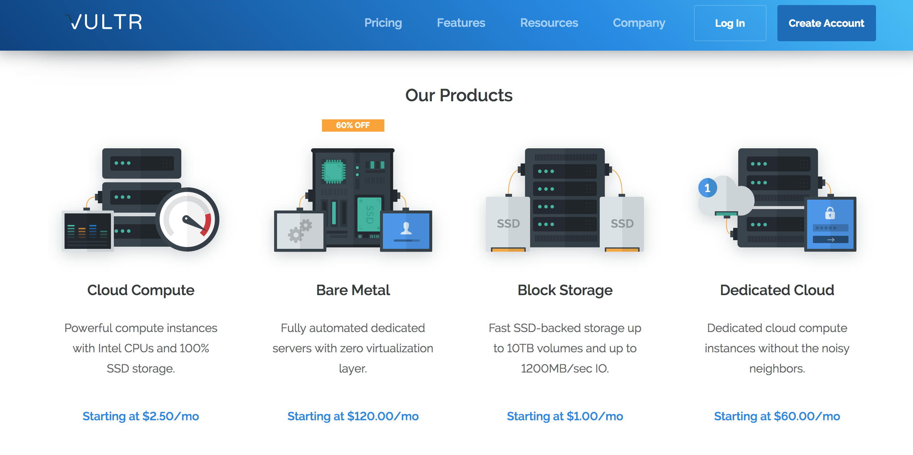
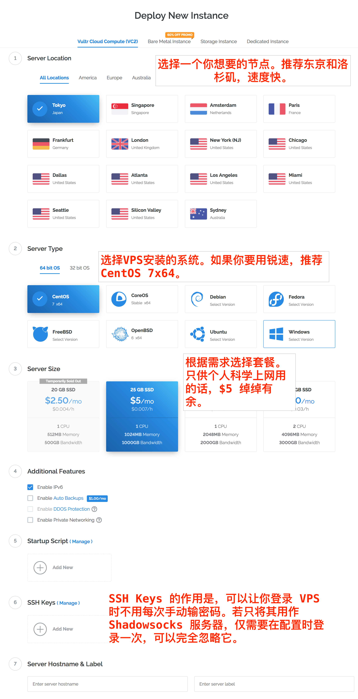
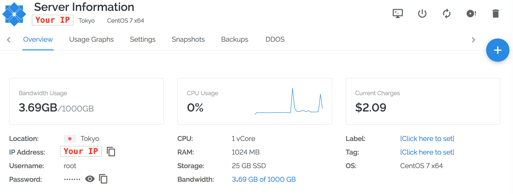

**本文将介绍在Mac环境下搭建VPS服务器来科学上网**
<!-- more -->

# 前言
曾经也用过蓝灯，鱼摆摆等科学工具来实现科学上网，后来渐渐的要不就是失效，要不就是价格偏高，而且作为一个爱折腾的人，这些实在是不得劲，稳定性很差，既然都是通过海外服务器来实现，那还不如自己直接整一个来的干脆利落，而且稳定性和速度都6得飞起，首先在这里得声明，天下没有免费的午餐，优质的服务器还是得花费一定的费用，如果你只是用来搭建科学上网环境，那么你也可以通过共享给小伙伴或者其他方式来分摊你的压力。本文主要介绍利用Vutrl和Shadowsocks配合搭建科学上网环境。
# 1 科普
这部分介绍一些搭建过程中涉及到的背景知识：
## 1.1 什么是 Shadowsocks
shadowsocks的工作原理

Shadowsocks(ss) 是由 [Clowwindy](https://github.com/Clowwindy)开发的一款用来加密传输资料的软件，不过也正因为它加密传输资料的特性，使得 GFW 无法区分它所传输的资料。

## 1.2 什么是 VPS 和 Vultr
VPS (Virtual private server) 译作虚拟专用伺服器。你可以理解为是云端的一台远程电脑，你可以给它安装操作系统、软件，并通过一些工具连接和远程操控它。
[Vultr](https://www.vultr.com/) 是一家 VPS 服务器提供商，有美国、亚洲、欧洲等多地的 VPS。它家的服务器以性价比高闻名，按时间计费，最低的资费为每月2.5美刀，不过现在已经脱销了，最低只有5美刀的了。

比 Vultr 价格更低的服务商也有许多，比如[搬瓦工](https://bandwagonhost.com/)，和 V 家差不多的配置只要19.9美刀每年,但是夜间的速度实在慢的感人。

## 1.3 什么是 Linux 和 SSH
Linux 是免费开源的操作系统，大概被世界上过半服务器所采用。有大量优秀的开源软件可以安装，上述 Shadowsocks 就是其一。你可以通过命令行而不仅仅是通过图形界面来给 Linux 操作系统「下命令」，比如进入一个文件夹。
而 SSH 是一种网络协议，作为每一台 Linux 电脑的标准配置，用于计算机之间的加密登录。当你为租用的 VPS 安装 Linux 系统后，只要借助一些工具，就可以用 SSH 在你自己的 Mac/PC 电脑上远程登录该 VPS 了。
# 2 购买和连接 VPS
## 2.1 注册 Vultr 和部署 VPS
访问 [Vultr.com](https://www.vultr.com/) 注册帐号，然后按下图进行部署心得服务器。


## 2.2 连接 VPS
找到你刚刚买的VPS的配置信息,最关键的就是IP地址和密码

打开你的Mac终端，输入：

```
ssh root@<Your IP>
```
然后按照提示去你的VPS那复制密码过来黏贴就行（需要注意的是linux中密码是不会显示出来的，所以你只要按回车键就可以了）
当出现下面的代码时，说明已成功登录。
```
[root@vultr ~]# 
```
# 3 部署 Shadowsocks
Shadowsocks 需要同时具备客户端和服务器端，所以它的部署也需要分两步。
## 3.1 部署 Shadowsocks 服务器端
这里使用 [teddysun](https://teddysun.com/342.html) 的一键安装脚本,依次执行下面3条命令，每次输入一行、回车，等待屏幕上的操作完成后再输入下一条。
```
wget --no-check-certificate https://raw.githubusercontent.com/teddysun/shadowsocks_install/master/shadowsocks.sh
```
```
chmod +x shadowsocks.sh
```
```
./shadowsocks.sh 2>&1 | tee shadowsocks.log
```
第三步输完，依次为你的 Shadowsocks 服务设置一个密码和端口（端口输入1-65535 间的数字就ok），然后你就只需要等你的Shadowsocks 的配置信息显示出来，其中你的IP地址，密码，端口和加密方式都很重要，截图保存。
## 3.2 安装 Shadowsocks 客户端
在你需要科学上网的设备上面安装相对应的客户端，这个Mac的下载Mac客户端，Windows下载PC版本的客户端，手机就找相应支持的APP就行，这里就自己动手找合适的版本就行。
一般都是打开客户端，在「服务器设定」里新增服务器。然后依次填入刚才截图的服务器 IP、服务器端口、你设的密码和加密方式。
新增服务器
然后启用代理，到这里你就已经可以科学上网了。


