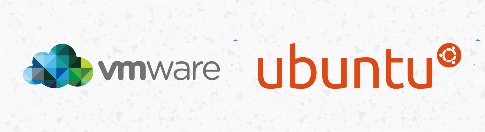
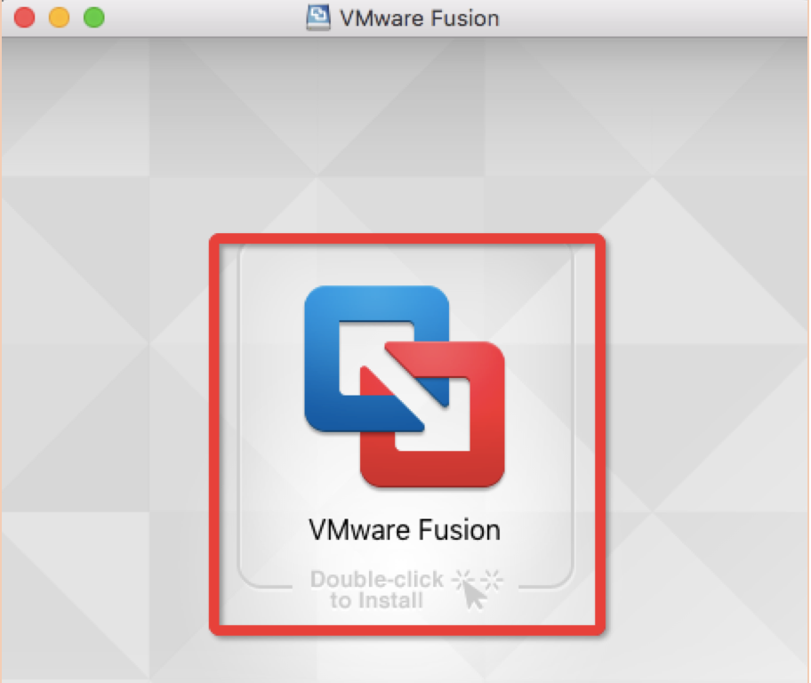
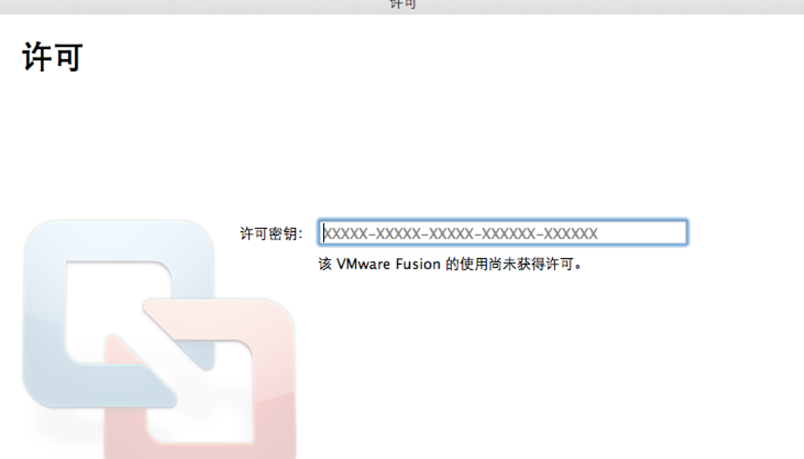
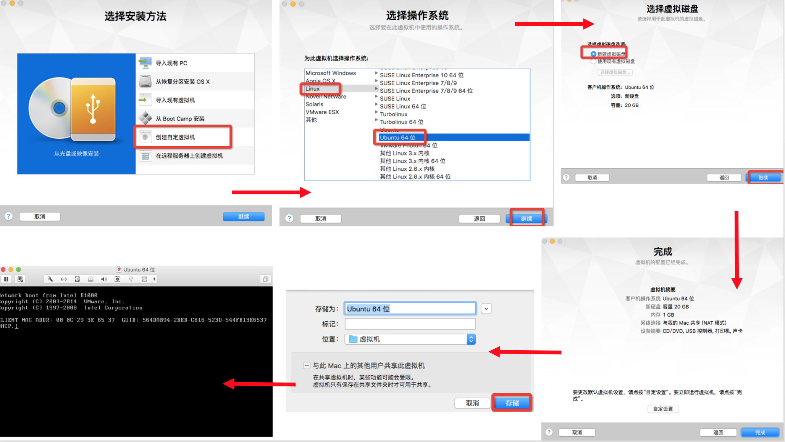
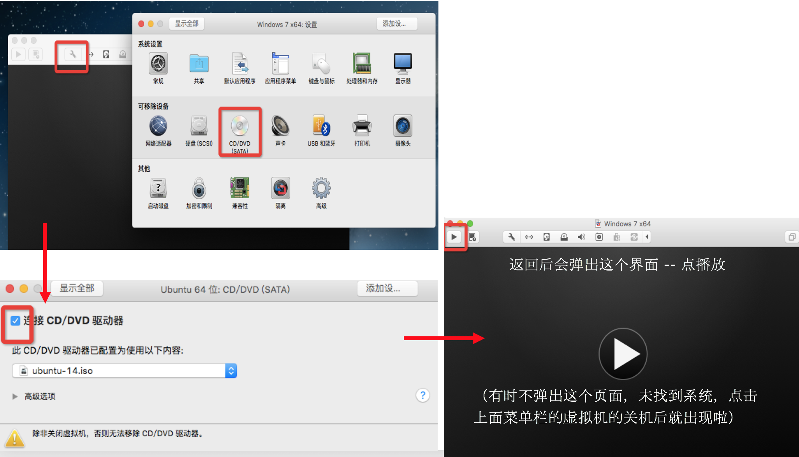
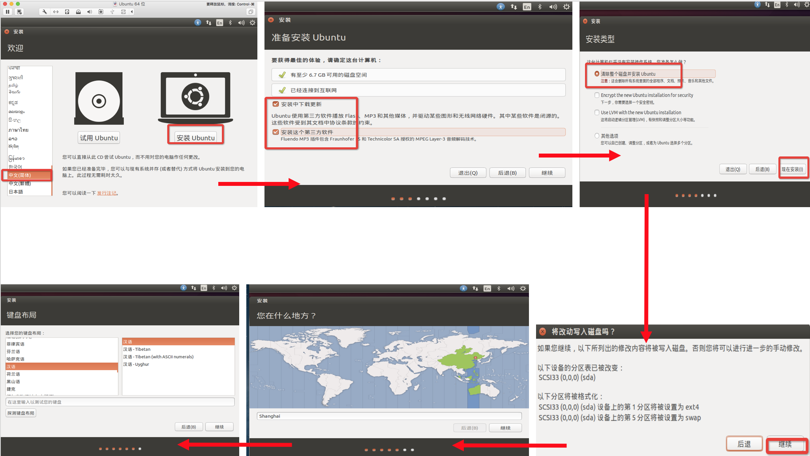
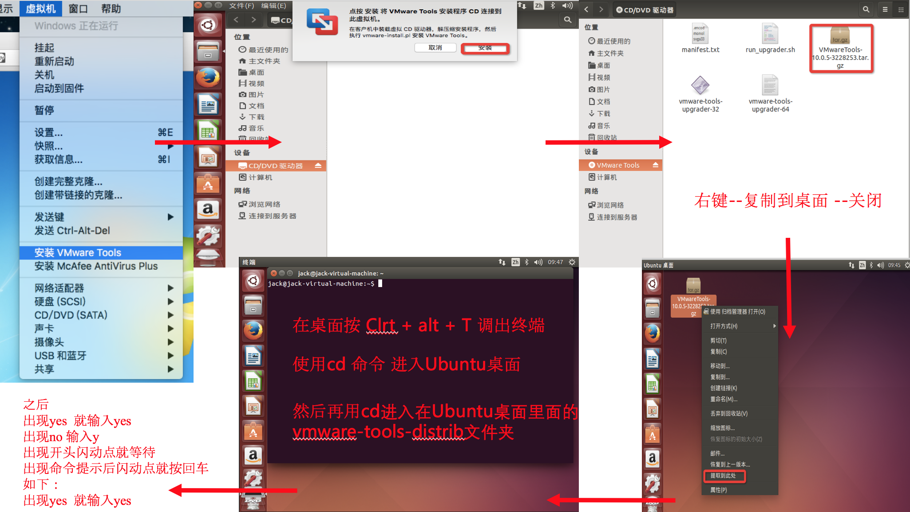

**本文会介绍如何在Mac上利用VMware Fusion虚拟机安装Ubuntu系统**
<!-- more -->

# 1 在Mac上安装VMware Fusion虚拟机
1.下载VMware fusion for Mac，直接去[官网](https://www.vmware.com/products/fusion/fusion-evaluation.html)下载即可。

2.然后安装VMware Fusion，一路下一步就可以。

3.输入注册码，注册码上网搜索一下最新的即可。

4.最后完成即可。

# 2 安装Ubuntu
1.在网上下载ISO镜像，安全点就直接去官网下载

2.镜像下载好之后就按下图的顺序操作

3.基本到这里就已经全部配置好了，但是还存在不能全屏等问题，需要安装VMware Tools

4.完成Ubuntu搭建

