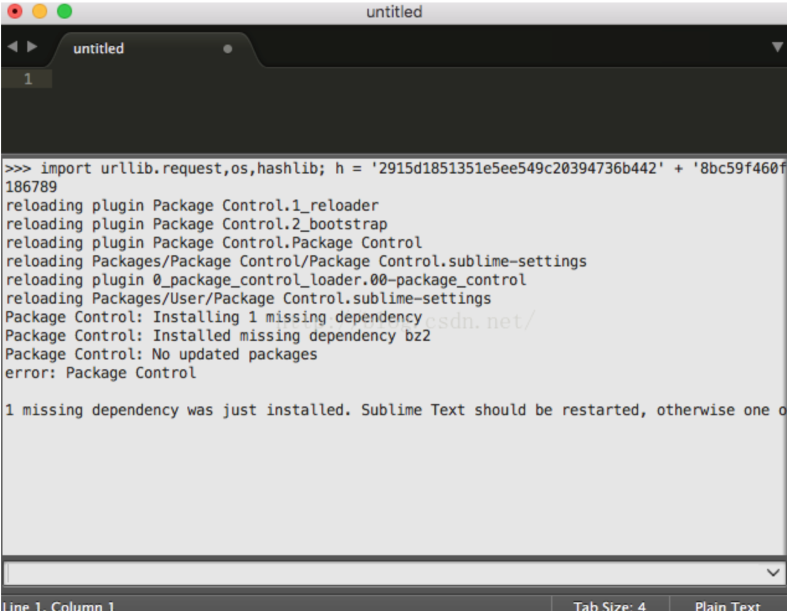
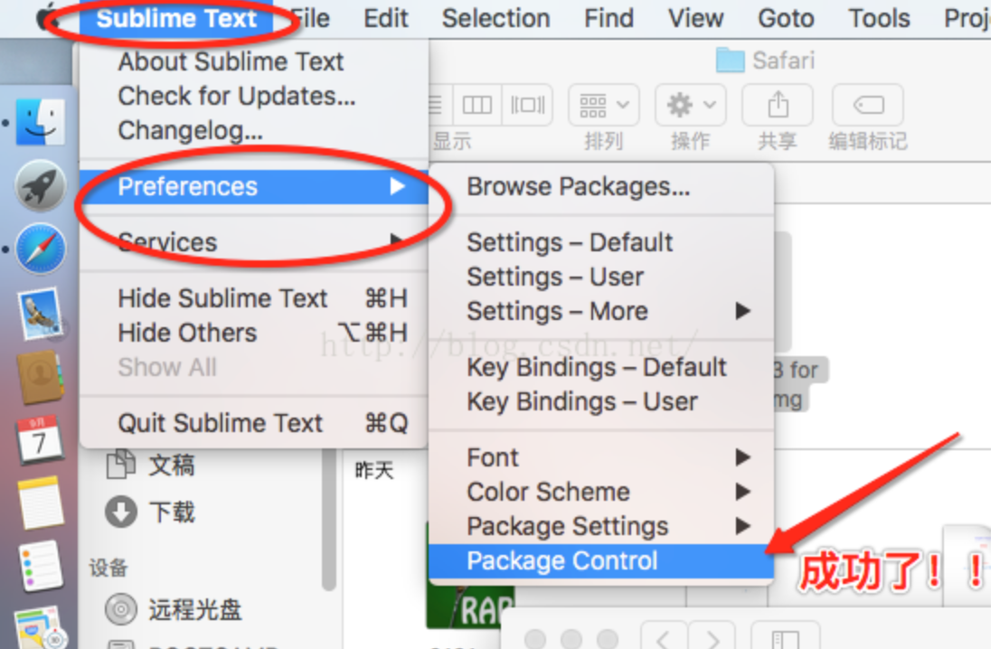
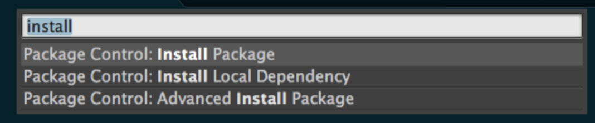
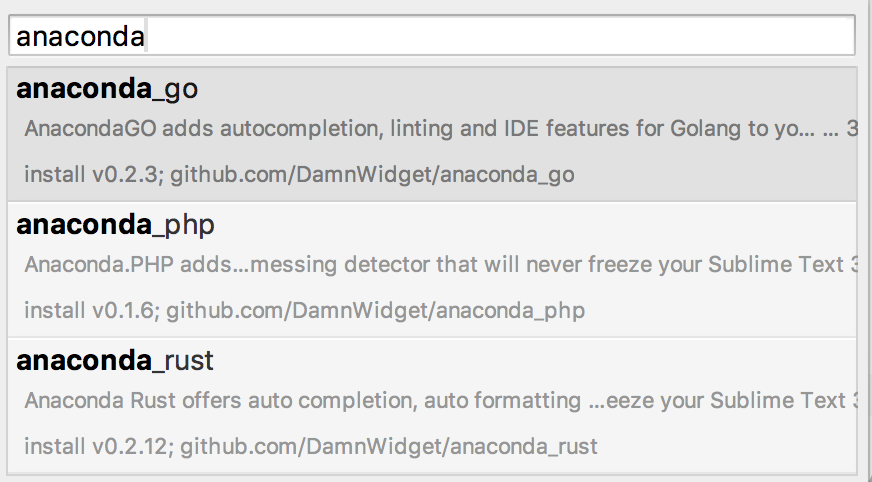

**本文介绍在Mac上配置Sublime Text**
<!-- more -->

# 1 下载Sublime Text
去官网下载Sublime Text[官网](https://www.sublimetext.com/3)

# 2 注册
输入注册码：

注册码可以在搜索引擎直接搜索，搜最近的结果就行。

将搜索到的注册码复制粘贴到软件的输入框里，按回车，提示成功，这时就可以使用了


注意：安装SublimeText3时，不会自动弹出来让你输入注册码。点击上面的Help－－－Enter License进行输入.


# 3 安装插件Package Control

这个工具可以来安装后面需要的所有插件。打开已经安装好的 Sublime Text 3，然后点击顶部菜单的 View -> Show Console（或者使用快捷键 command + ` ）。

在下面的输入框里复制下面的代码

```
import urllib.request,os,hashlib; h = '2915d1851351e5ee549c20394736b442' + '8bc59f460fa1548d1514676163dafc88'; pf = 'Package Control.sublime-package'; ipp = sublime.installed_packages_path(); urllib.request.install_opener( urllib.request.build_opener( urllib.request.ProxyHandler()) ); by = urllib.request.urlopen( 'http://packagecontrol.io/' + pf.replace(' ', '%20')).read(); dh = hashlib.sha256(by).hexdigest(); print('Error validating download (got %s instead of %s), please try manual install' % (dh, h)) if dh != h else open(os.path.join( ipp, pf), 'wb' ).write(by)
```


如下图：

紧接着，查看是否已经安装成功

接下来是插件安装

通过快捷键`Command + Shift + P`  打开 `Package Control` 来安装插件。在打开的输入框中输入 `install`，会根据输入状态自动提示，用鼠标点击或键盘回车选择 Install Package 进入查找安装界面：

等待几秒钟后，在新弹出的输入框里，输入你想要安装的插件名称：

用鼠标点击或键盘回车选择后，等待一段时间即可安装成功。所有的插件都存放在下面这个文件目录里，每个插件都有独立的文件夹：

`/Users/你的Username/Library/Application Support/Sublime Text 3/Packages`

等待几秒钟后，在新弹出的输入框里，输入你想要安装的插件名称：

这个根据你的需要下载相应的插件

# 4 用命令行打开Sublime
到上一步已经把Sublime基本配置好了，但是如果经常用命令行的话还不能直接用命令行打开Sublime，所以需要进行这一步

在你的终端文件里，加上：
```
alias subl=\''/Applications/Sublime Text 2.app/Contents/SharedSupport/bin/subl'\'
```
一般终端文件就是 ~/.bashrc 或者是 ~/.bash_profile
如果是Sublime Text 3 的用户，可以把路径中的 /Sublime Text 2.app/ 改成 /Sublime Text.app/ 就可以了。


