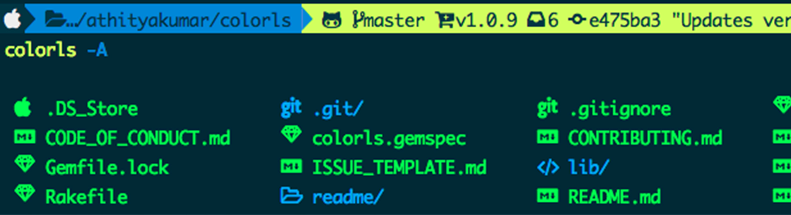
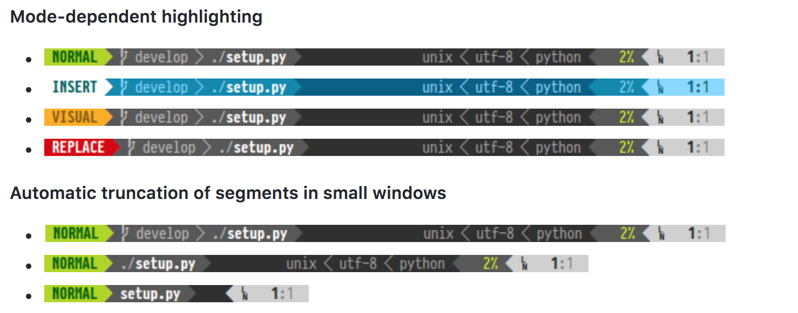
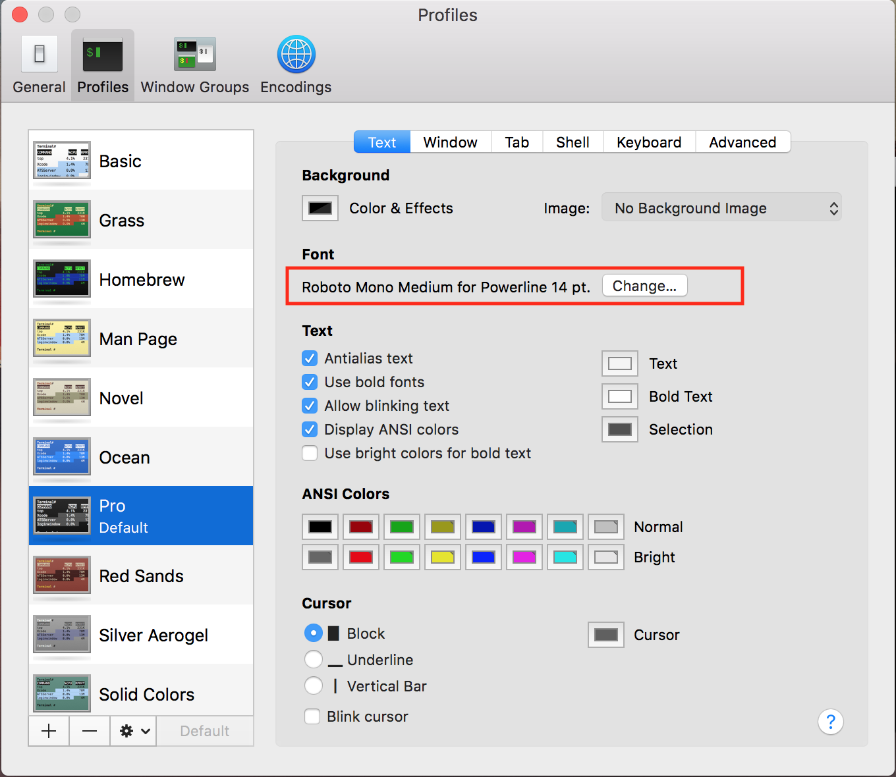

**本文将介绍在Mac环境下用powerline配置你的Terminal终端**

<!-- more -->

# Powerline 是什么
Powerline是一个stateless status line，即一个全局状态/提示栏。你可以为你的bash,Terminal,iTerm2,VIM配置上powerline，然后就会变成这样：

你的Mac终端提示栏将会是这样的：

你的VIM状态栏会是这样的：

正所谓磨刀不误砍柴工，为你的工作环境配置一个好看的状态栏，极大的提高了工作效率。

# Mac上安装Powerline
因为Powerline项目下涵盖了适配各种APP(bash，vim等)的代码，所以你可以在Mac任何一个地方下载该代码包，然后在不同的APP中配置这个路径，以Plugin形式加载。本文暂时介绍配置Mac的默认Terminal的方法。

对于Mac的环境，确保Python版本大于等于2.7，如果不是，可以通过homebrew安装，这里不做赘述。也可以一步到位安装Python3，至少这是未来的趋势。
```
shell> python -v
Python 2.7.9
```
在确保环境之后，通过pip安装Powerline：
```
shell> pip install powerline-status
```
安装完成后通过pip show powerline-status查看powerline所在的具体路径。

注意：这里的路径很重要，会用在之后的配置环节
```
shell> pip show powerline-status
Name: powerline-status
Version: 2.6
Summary: The ultimate statusline/prompt utility.
Home-page: https://github.com/powerline/powerline
Author: Kim Silkebaekken
Author-email: kim.silkebaekken+vim@gmail.com
License: MIT
Location: /Users/lib/python3.6/site-packages
Requires:
```

# 配置Bash使用powerline
配置方法很简单，只需要找到你Mac的Bash配置文件位置(例如：/etc/bashrc，~/.bashrc，~/.bash_profile)，然后在其中增加一行调用安装路径下的bindings/bash/powerline.sh即可。这样每次调用生成新的Bash窗口时，都会自动执行powerline.sh文件中的内容。下面以~/.bash_profile为例：
```
shell> echo << EOF >> ~/.bash_profile 
. /Library/Python/2.7/site-packages/powerline/bindings/bash/powerline.sh
EOF  
shell> . /Library/Python/2.7/site-packages/powerline/bindings/bash/powerline.sh
```
注意：根据python安装方式的不同，你的powerline所在路径也可能不同。请根据实际情况修改上面的命令。

# Teriminal字体配置
执行完上面的步骤后，不出意外powerline就开始工作了。打开你的终端，你会发现提示符是一些乱码，出现这样情况的原因是powerline为了美观自己造了一些符号，而这些符号不在Unicode字库内（如果你不知道Unicode字库是什么的话可以看下博主以前的相关介绍）。所以想要powerline正常显示的话，需要安装特殊处理过的字体。好在有一位热心人的帮助，他把大部分的程序猿常用的等宽字体都打上了powerline patch使得我们的这部配置将异常简单。首先我们从github上下载并安装字体：
```
shell> git clone https://github.com/powerline/fonts.git
shell> cd fonts
shell> ./install.sh
```
安装完成后我们就可以在iTerm2或者Terminal的字体选项里看到并选择多个xxx for powerline的字体了。*注意：对于ASCII fonts和non-ASCII fonts都需要选择for powerline的字体。如下图： 


至此就应该全部配置好了。


