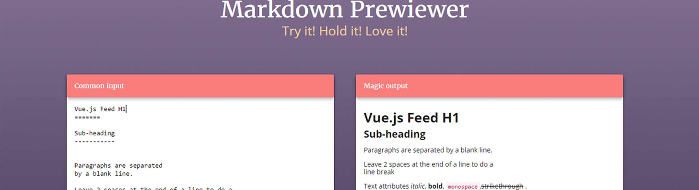

<!-- more -->

本文介绍在PC端部署Markdown的环境

# 编辑器的选择

- Typora 是一个相对而言多平台且小且口碑都不错的编辑器，但是我个人无法习惯这种直接就显示内容的编辑器，相对而言，更习惯双栏显示的编辑器。
- CmdMarkdown 但是她更类似于在线同步的那种编辑器，所以放弃。
- Mweb 在在PC端没有客户端，所以没办法用。
- VScode 最终还是选择了开源的编辑器，然后加插件来解决编辑问题。

## VSCode部署环境

- 1.Markdown All in One 

- 2.Markdown Preview Enhanced 这个插件的主要是一个很好用的完善预览功能的插件，可以更加形象的展示所编写的pdf格式的文档样式。在插件库中搜索markdown即可找到该插件，然后点击安装后重新加载。

- 3.如需更多配置信息，可以参考[这里](https://www.jianshu.com/p/9f13e971fe6b)。

