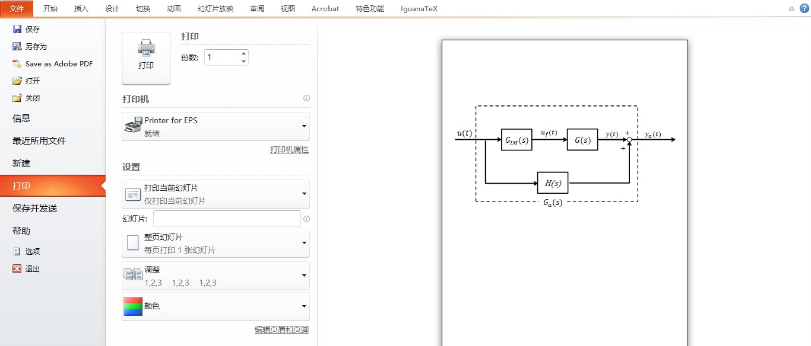
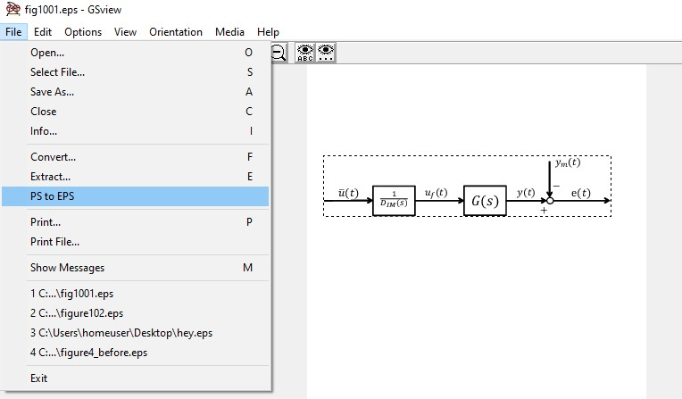
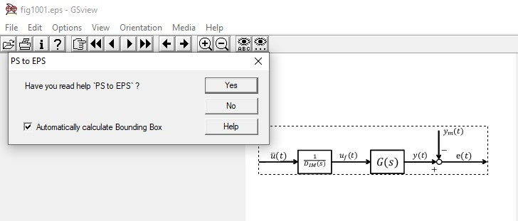

<!-- more -->

# 1安装LaTex

**核心内容2歩**
- 安装LaTex
- 部署Atom

## 1.1 安装LaTex

- 无论是Mac环境还是PC环境，都需要现在电脑上装好LaTex，具体操作步骤直接百度和谷歌会更加迅速，整个安装包自动下载，但是安装包比较大，花费时间会比较长。

## 1.2 部署Atom

 这一步主要就只是给Atom装三个Package，分别是：
- latex
- language-latex
- pdf-view

如需更多配置信息，可以参考[这里](https://www.jianshu.com/p/b16fde27353b)

# 2 LaTex导入eps插图

画图的方式有很多，这边用最简单的PPT中直接画图，PPT中自带的公式即可输入，操作简单方便。

## 2.1 PPT打印出图

画完图，需要打印，这里需要安装一个打印eps的虚拟打印机。

## 2.2 调整边界

打印出图之后的eps文件，边界是很大的，就是原文件的边界，所以我们需要裁减，使它沿着最小出图边界自动裁减。

### 2.2.1 安装GSview

[下载地址](http://pages.cs.wisc.edu/~ghost/)

### 2.2.2 裁减出图
打开之后直接修剪

勾选自动裁减

## 2.3 Note

- **虽然在ppt中可以安装IguanaTex插件，但是输入的公式有的时候会报错或者不显示的情况，所以还是直接用PPT自带的公式编辑器编辑公式更好一点。**

- **虽然原则上是支持其他文件格式的图片插入的，但是支持最好的还是eps格式的图片 **

# 注意点

- 在公式栏中是不可以随便空行的，会产生很多未知的错误
- \hspace可以很好的调节公式之间的间距

　　　　　　　

