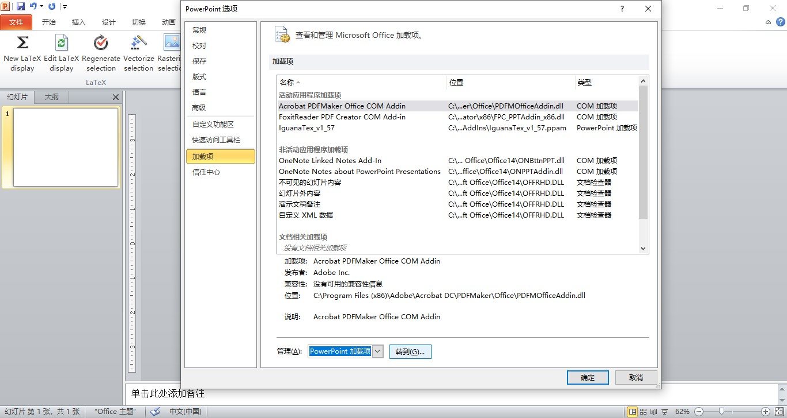
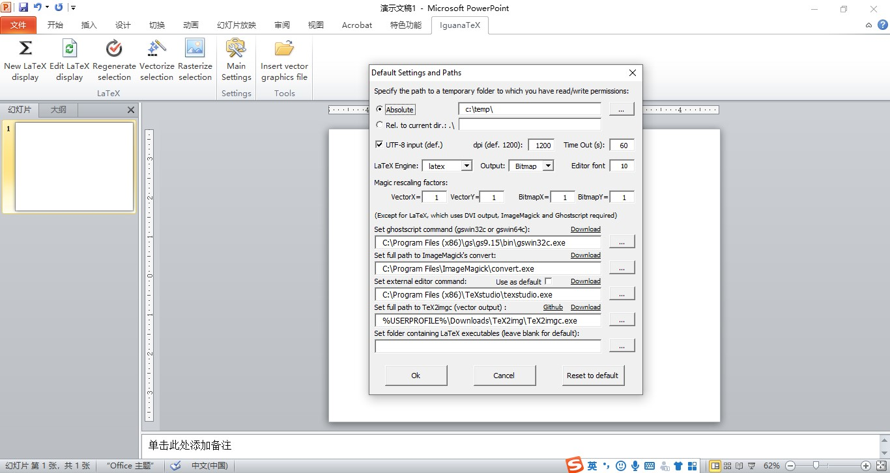
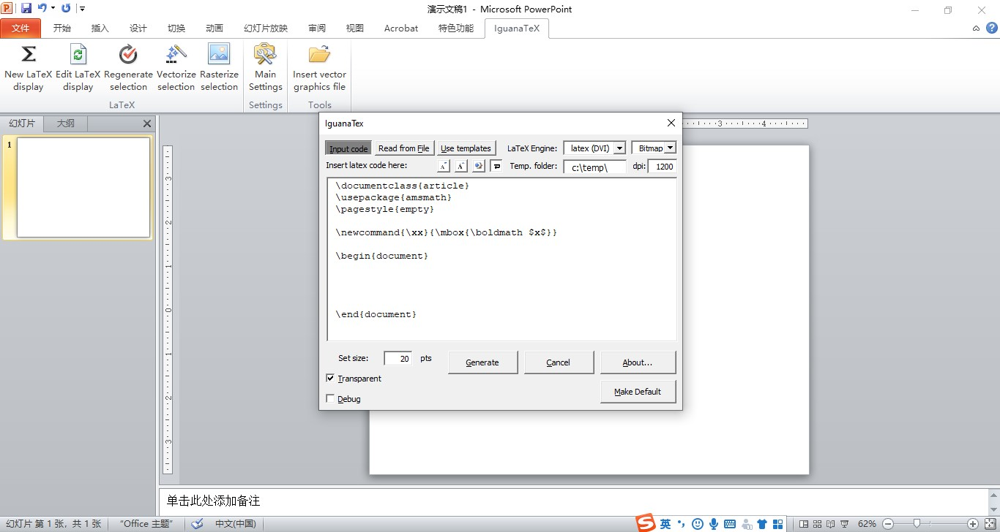

<!-- more -->


# 1 前提

电脑已经配置好latex环境

# 2 安装过程

**2.1 下载IguanaTex_v1_56插件**

[官网下载地址](http://www.jonathanleroux.org/software/iguanatex/download.html)
下载的文件格式为：`IguanaTex v1.56 (.ppam) .ppam`

**2.2 移动插件**

将IguanaTex v1.56 .ppam移动到`C:\Users\ 你的用户名\AppData\Roaming\Microsoft\AddIns`目录下。

**2.3 创建临时文件夹**

在C盘创建一个空白文件夹，并复制该文件夹路径。

**2.4 设置PPT激活Iguana**

打开`PowerPoint > 文件 > 选项 > 加载项 > 管理 > 下拉 > 选择PowerPoint加载项`，选择`IguanaTex v1.56 .ppam`


**2.5 设置Iguana**

在PowerPoint面板点击`IguanaTex`，点击`main settings`,在路径处粘贴之前创建的文件夹路径。


# 3 使用
使用就是按照正常的LaTex的输入使用即可。



以下为[Reference](http://www.jonathanleroux.org/software/iguanatex/download.html)：

```
Installation:

1.Load the add-in:
in “File” > “Options” > “Add-Ins” > “Manage:”, choose “PowerPoint Add-Ins” then “Go…”, then click “Add New”, select the .ppam file in the default Add-In folder or in the folder where you downloaded it, then “Close”

2.Create and set a temporary file folder:
IguanaTex needs access to a folder with read/write permissions to store temporary files.
The default is “C:\Temp”. If you have write permissions under “C:”, create the folder “C:\Temp”. You’re all set.
If you cannot create this folder, choose/create a folder with write permission at any other location. In the IguanaTex tab, choose “Main Settings” and put the path to the folder of your choice. You can also use a relative path under the presentation’s folder (e.g., “.” for the presentation folder itself).

3.(Optional, for pdflatex/xelatex/lualatex support) Install and set path to GhostScript and ImageMagick:
To use the PDF to PNG conversion (i.e., with pdflatex, xelatex and lualatex) instead of the default DVI to PNG one, you need to install GhostScript and ImageMagick and set the appropriate full paths to gswin32c.exe/gswin64c.exe (note the “c”!) and convert.exe in the “Main Settings” window. When installing ImageMagick, make sure to check the box to “Install development headers and libraries for C and C++” and (in recent versions) to “Install legacy utilities (e.g. convert)”. Download links are provided in the Main Settings window.

4.(Optional, for vector graphics support) Install and set path to TeX2img:
To use vector graphics output, you need to install TeX2img (here is the direct download link for recommended version 2.1.0). After unpacking TeX2img somewhere on your machine, please run TeX2img.exe once to set the various paths to latex/ghostscript, then set the full path to TeX2imgc.exe (note the “c”!) in the “Main Settings” window.

```


