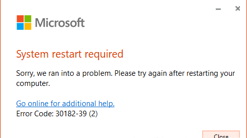
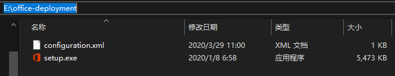
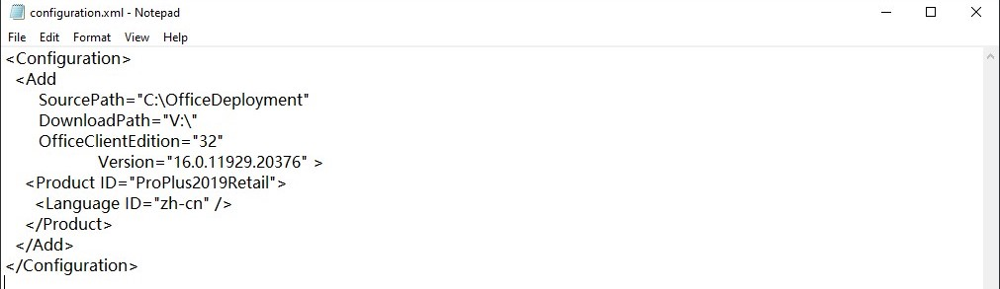
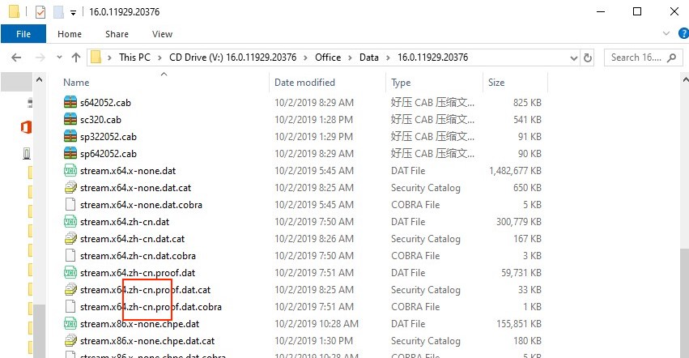
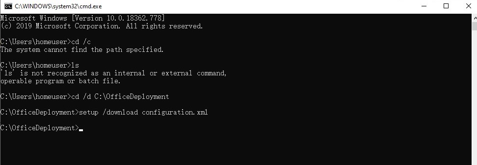
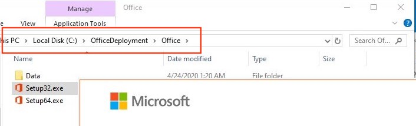
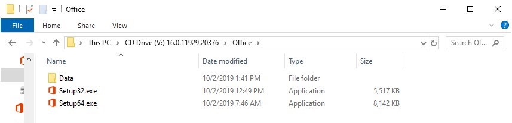
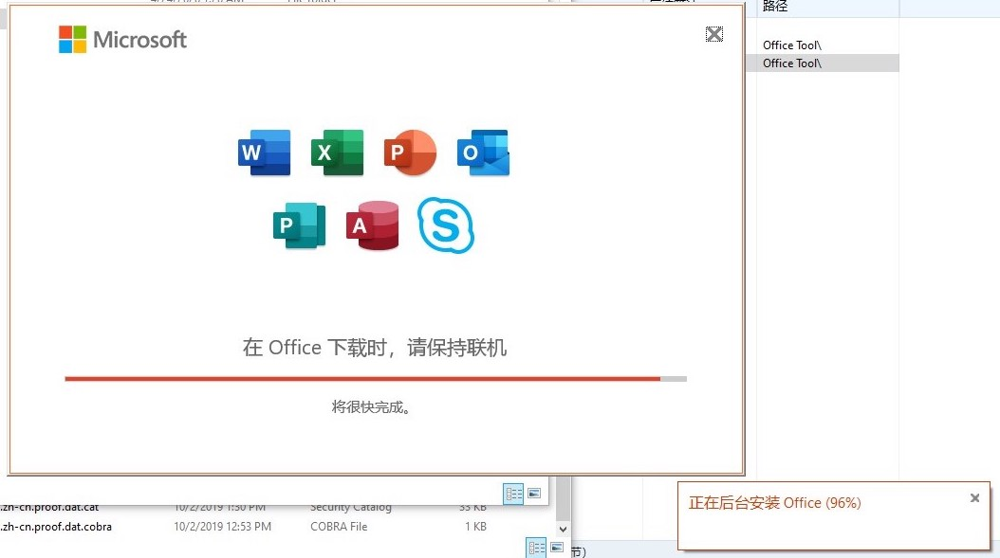

<!-- more -->


# 问题描述

挂载Office 2019安装镜像后直接安装会出现如下错误：

问题原因在于Office 365与Offfice2019版本号相同（均为16.0）[官方页面-各Office版本号](https://docs.microsoft.com/zh-cn/DeployOffice/install-different-office-visio-and-project-versions-on-the-same-computer)

# 解决办法

**解决方法就是利用官方部署工具进行安装，绕过版本冲突问题 **


1.下载安装Office 部署工具（[Office Deployment Tool](https://www.microsoft.com/en-us/download/confirmation.aspx?id=49117)）
---
2.解压至任意文件夹
---
运行上一步下载的文件，会自动解压到你指定的文件夹


3.新建一个“configuration.xml”配置文件
---
配置文件的配置方法参考（[配置文件官方说明](https://docs.microsoft.com/zh-cn/deployoffice/office-deployment-tool-configuration-options)）

可参考以下进行配置：
```
<Configuration>
  <Add 
       SourcePath="C:\OfficeDeployment" 
       DownloadPath="V:\"
       OfficeClientEdition="32"
	   Version="16.0.10730.20102" >
    <Product ID="VisioStd2019Retail">
      <Language ID="en-us" />
    </Product>
  </Add>
</Configuration>
```

**元素解释：**

- SourcePath：用于放安装包的临时文件夹，任意空目录即可
- DownloadPath：安装包下载路径，因为已经挂载虚拟磁盘故填入虚拟磁盘路径
- OfficeClientEdition：安装的Office软件位数，32或64
 **(如果不是专业用户，32位的版本兼容性会更好) **
- Version：安装的Office软件版本号，在虚拟磁盘文件内可以找到（如：H:\Office\Data\16.0.10730.20102）

- Product ID：产品ID，参考[官方产品ID目录](https://docs.microsoft.com/zh-cn/office365/troubleshoot/installation/product-ids-supported-office-deployment-click-to-run)，按照安装的软件输入对应产品ID
（VisioStd2019Retail代表Visio2019标准零售版）
- Language ID：安装版本的语言，输入已挂载镜像安装文件拥有语言，可通过查看镜像文件名得知



4.安装配置文件
---
Win+R运行CMD，进入部署工具的目录`cd /d E:\office-deployment`，运行安装配置文件`setup /download configuration.xml`


5.将虚拟磁盘的Setup.exe拷贝至SourcePath路径下
---
之后可能会出现“0-1007(0)”安装错误，关掉提示不用管。打开在`SourcePath`填入的路径，在目录下应该会出现一个Office文件夹。

将虚拟磁盘的Setup.exe拷贝至SourcePath路径下。


6.运行SourcePath路径下的Setup.exe进行安装即可
---


# Note

- 在这里吹爆[胡萝卜周](http://www.carrotchou.blog/19209.html)这个网站和这个博主，互联网的自由就是体现在这种无私奉献的精神上（当然我们不是推荐使用盗版，在能力范围之内我们都应该支持版权精神支持正版）
- 为什么用本文中这个麻烦的方法，而不直接用相对简单的一键安装，因为之前已经装了32位的版本，而且装了2016版的OneNote，为了保留之前的版本的前提下进行升级。

