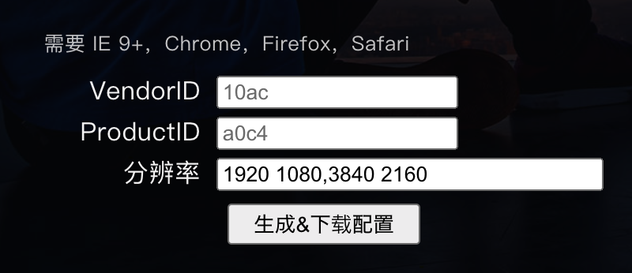
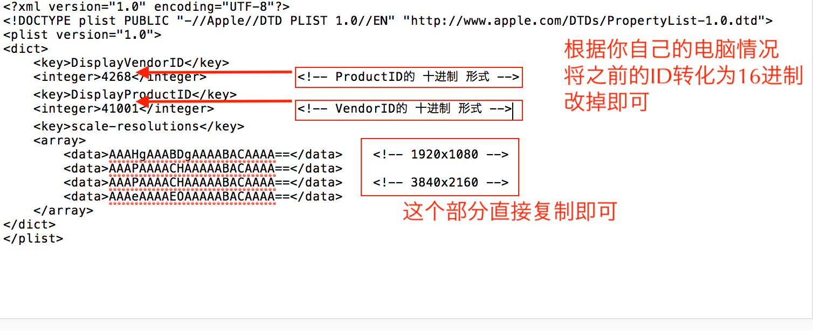

<!-- more -->


# 1.前言：
入手了一台2K显示器，但是直接连HDMI线显示的效果不忍直视，所以我们需要开启苹果系统的hidpi模式来实现完美显示。
至于为什么要开启hidpi模式？2k显示器的分辨率是2560*1440，如果采用默认的设置，那么在显示器上面的字会特别的小。我尝试了用最新版的SwitchResX来强制打开1080P的分辨率，但是实际的效果并不好，虽然大小适配了，但是字体发虚，在查阅了不少资料之后，总结了这篇文章中最简单的实现HiDPI的方法。希望这篇文章可以帮到你。

# 2.解决办法：

# 2.1 打开系统HiDPI (终端运行）
`sudo defaults write /Library/Preferences/com.apple.windowserver DisplayResolutionEnabled -bool YES`
如果使用 4K 或更高分辨率的显示器，macOS 基本上原生支持 HiDPI，直接下载从RDM即可。如无法启用或没有合适的分辨率，再使用配置文件。

# 2.2 禁用SIP (macOS 10.11及以上)
macOS 10.11 El Capitan 开始默认启用 System Integrity Protection (SIP) 防止系统文件被修改。因为配置文件需要放在系统文件夹中，要禁用 SIP。

开机或重启时，在听到开机的那个声音之后按住`Command + R` 组合键，进入 macOS 恢复模式，在屏幕上方的菜单中选择 `Utlities > Terminal` 打开终端，输入并执行：
`csrutil disable`
然后重启系统。进行下一步。

**在全部设置完以后，建议安全起见还是重新启用 SIP，按照以上步骤进入恢复模式，输入并执行 `csrutil enable ` **

```
在这里插一句，最开始我做完这一步就直接去用SwitchResX的设置方法设置了强制打开1080P的分辨率，但是效果很不好，虽然适配了显示的大小，但是所有的显示都发飘，于是就有了以下的设置方法。
```

# 2.3 获得显示器信息
获得显示器信息有很多种方法，在这里用最简单的，我们分别需要获得显示器的 VendorID 和 ProductID （制造商ID 和 产品ID），在终端运行：
`ioreg -lw0 | grep IODisplayPrefsKey | grep -o '/[^/]\+"$'`
输出大概是这样的：
```
> ioreg -lw0 | grep IODisplayPrefsKey | grep -o '/[^/]\+"$'
/AppleBacklightDisplay-610-a029"
/AppleDisplay-10ac-d0ff"
```
第一条AppleBacklightDisplay-610-a029是MBP的内置显示屏。
第二条是外接显示器。如果你合上屏幕，这样只会输出正在使用的外接显示器。
着重在第二条，`/AppleDisplay-10ac-d0ff"` 这里的`10ac`和`d0ff`是两个十六进制数。第一个为VendorID，第二个为ProductID。电脑不同，显示的数值不同，这里的数值是我的电脑为例。

# 2.4 生成配置文件夹
# 2.4.1 简单方法
①生成配置文件
这一步的配置如果自己输入比较复杂，建议直接采用一键生成的方式进行配置，参考大神的[制作](https://wacky.one/blog/macos-hi-dpi/#copy-conf)。
具体按下图设置，分辨率你直接按下图填入即可，两个ID需要根据你的实际情况进行填写。

点击生成之后就已经生成了配置文件了。
②创建配置文件夹
这一步简单，直接创建一个空白文件夹，重命名`DisplayVendorID-xxx`这里的`xxx`就是你上一步的VendorID。
③将①中的配置文件复制到②中的文件夹中
④将③中的文件夹拷贝到以下路径的文件夹中
```
# OS X 10.11及以上
DIR=/System/Library/Displays/Contents/Resources/Overrides
# OS X 10.10及以下
DIR=/System/Library/Displays/Overrides
```
到这里为止，准备工作就基本完成了。
如果这里的一键生成配置ok的话，直接跳到2.5即可。
如果这里的一键生成配置失效的话，就只能用2.4.2的复杂方法进行手动配置。

# 2.4.2 复杂方法
其实也不复杂，按照如下图所示，直接建立一个空白文档，将代码复制进去即可。

```
<?xml version="1.0" encoding="UTF-8"?>
<!DOCTYPE plist PUBLIC "-//Apple//DTD PLIST 1.0//EN" "http://www.apple.com/DTDs/PropertyList-1.0.dtd">
<plist version="1.0">
<dict>
    <key>DisplayVendorID</key>
    <integer>xxxx</integer>           
    <key>DisplayProductID</key>
    <integer>xxxx</integer>           
    <key>scale-resolutions</key>
    <array>
        <data>AAAHgAAABDgAAAABACAAAA==</data>    <!-- 1920x1080 -->
        <data>AAAPAAAACHAAAAABACAAAA==</data>
        <data>AAAPAAAACHAAAAABACAAAA==</data>    <!-- 3840x2160 -->
        <data>AAAeAAAAEOAAAAABACAAAA==</data>
    </array>
</dict>
</plist>
```
文件配置完成之后就按照2.4.1中的②③④操作即可。

# 2.5 使用RDM进行切换
重启系统打开RDM，这就可以进行切换了。
如图：


# 3 最后总结
这个方法是我自己尝试过不仅能够调节分辨率，而且也不会出现字体发飘的现象，而且应该是比较安全的一个方法。


