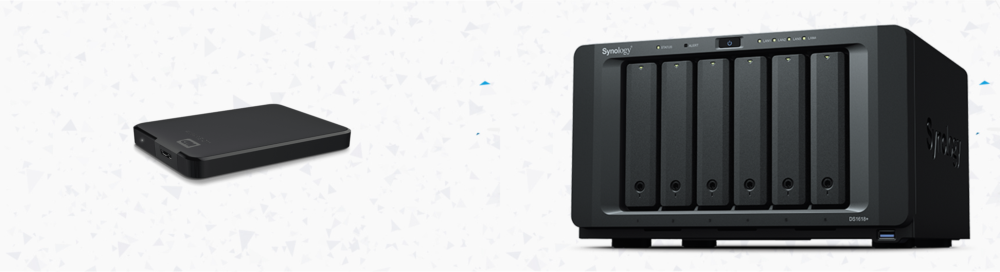
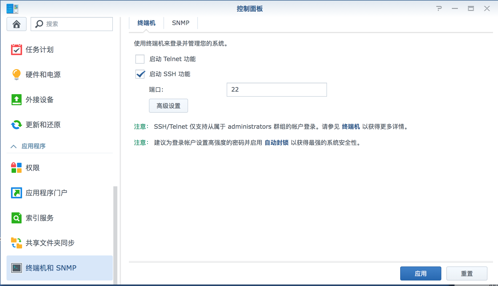
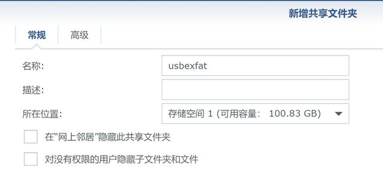
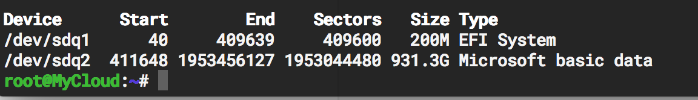
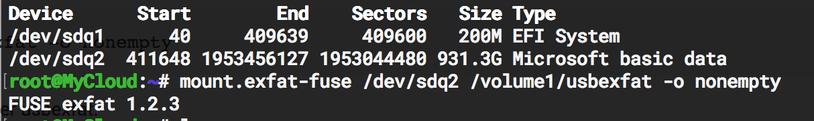
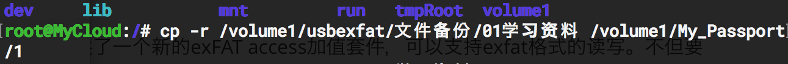

<!-- more -->

**本文介绍让群晖NAS系统DSM支持exfat文件格式**

# 前言
因为exfat是微软的专利格式，商业应用要交版权费用，所以群晖DSM系统都不支持exfat文件格式的读写。随着存储卡的越做越大，而一般大容量又有的时候在macOS系统和PC端都要用，那么往往都是用exfat格式保存的。这个时候要用NAS来直接备份存储卡，这就行不通了，必须先导入电脑，然后再通过电脑传到NAS上面，但是如果你的局域网路由器不是千兆级别的，那么传输速度基本就停留在了10M/s的速度，动辄几十上百G的文件，这得传到什么时候，所以必须得直接插在NAS上进行传输。

在DSM 6.0版本以后，群晖官方的确提供了一个新的`exFAT access`加值套件，可以支持exfat格式的读写。不但要花$3.99美金单独购买，而且只限在一台NAS上使用。不同的NAS或者重新安装系统以后，就不能用了。

但是群晖本身就是一个Linux系统，Ubuntu可以支持exfat格式，原理应该类似。借用Ubuntu的deb安装包`exfat-fuse`是可以实现的。网上有网友在`DSM 5.0`系统`DSM 6.0`系统上都能实现。以下为方法。

# 免责声明
这个方法并不是官方提供的，需要使用到一些简单的Linux命令，不熟悉的话，存在有一定风险。所以，请谨慎尝试，风险自担！

# 安装步骤
## 1.启动SSH功能
开启群晖的ssh的功能


## 2.激活root用户
先用管理员账户登陆ssh，激活root用户，退出后切换成root用户。
管理员账号登陆，按提示输入密码：
`ssh admin@192.168.1.100`
添加root用户，密码自己决定：
```
sudo su -
synouser --setpw root your_new_root_password
exit
```
用root用户登陆ssh：
`ssh root@192.168.1.100`

## 3.下载对应的exfat-fuse

由于DSM 5.0是32bit操作系统，而DSM 6.0是64bit，它们需要的安装包是不一样的，下面分开说明。

DSM 5.0安装方法：
```
wget -P /tmp/ http://mirrors.kernel.org/ubuntu/pool/universe/f/fuse-exfat/exfat-fuse_1.2.3-1_i386.deb
dpkg -x /tmp/exfat-fuse_1.2.3-1_i386.deb /tmp/exfat-fuse/
cp /tmp/exfat-fuse/sbin/mount.exfat-fuse /usr/bin/
```
DSM 6.0安装方法：
```
wget -P /tmp/ http://mirrors.kernel.org/ubuntu/pool/universe/f/fuse-exfat/exfat-fuse_1.2.3-1_amd64.deb
dpkg -x /tmp/exfat-fuse_1.2.3-1_amd64.deb /tmp/exfat-fuse/
cp /tmp/exfat-fuse/sbin/mount.exfat-fuse /usr/bin/
```
## 4.建立共享文件夹
登陆NAS界面，在存储空间1增加一个共享文件夹，例如：`usbexfat`
增加共享文件夹`usbexfat`


## 5.查看磁盘信息
插入exfat格式的U盘或者读卡器，然后回到ssh，查看磁盘信息：
`fdisk -l`
DSM 5.0下面的信息：
```
Device Boot Start End Sectors Size Id Type
/dev/sdu1 256 7823654 7823399 3.7G 7 HPFS/NTFS
```
DSM 6.0下面的信息：
```
Device Boot Start End Sectors Size Id Type
/dev/sdu1 256 7823654 7823399 3.7G 7 HPFS/NTFS/exFAT
```
以上信息根据具体自己的电脑信息等会不一样，大家可以根据自己的实际情况自己进行设置

## 6.手工挂载exfat分区
由于设备不同，`/dev/sdq2`这个分区可能不同，需要按照实际情况改成自己系统对应的。
`mount.exfat-fuse /dev/sdq2 /volume1/usbexfat -o nonempty`


## 7.成功访问
不出问题的话，现在通过共享文件夹usbexfat，愉快的访问内容。

## 8.文件处理
搞这么久可不止是为了让文件能在NAS系统中可以显现，虽然你现在已经可以直接在NAS的usbexfat文件夹中查看你的移动设备的内容，但是亲测，当你直接拷贝文件到其他NAS文件夹的时候，比远程拷贝更慢，我感觉可能是因为一边从nas拷贝到你的电脑主机，再从电脑主机拷贝到你的NAS，这个操作实在是太骚了，得不偿失。于是我尝试了直接用Linux系统的命令行就行拷贝操作，证明用命令行的操作会快非常多，虽然不能直接看到拷贝速度，但是亲测50G的文件夹也就几分钟的事。

**注意以上图片中的拷贝模式**

**这个也同样适用于在NAS系统中不同共享文件夹之间的文件处理，如果直接在电脑端进行操作，操作的逻辑就是先复制到电脑端，再复制到NAS端，这样的操作逻辑虽然可视化，但是对于大文件夹来说简直就是得不偿失，所以直接以用户名形式进入Linux系统，然后再进行相应的文件操作，速度快到飞起。**

**另外，cp命令对于大文件还是很慢，但是mv命令基本就是瞬间完成。**

## 9.用完后，可以手工卸载exfat分区：

`umount /volume1/usbexfat`

## 10.弹出设备

`eject -F /dev/sdu1`

# 总结
目前的方法，有以下的优缺点：
## 优点：
```
完全免费！省去了购买$3.99美金的加值套件——虽然折合20多元并不是很贵，能省一点是一点。
DSM 5.0和6.0都支持，不分黑群白群，而且安装数量的限制——自己任性安装，想装几台就装几台。
```
## 缺点：
```
读取exfat格式支持度较好，但不建议写入！
写入后，再插到电脑上用，会提示卡有错误，需要扫描一次来修复。
使用exfat主要是备份存储卡的数据，所以尽量不要在NAS里面写入数据。
需要手工挂载和卸载exfat分区，略显麻烦，不过这个也是有解决办法的。
```


# Reference

1.[参考1](https://xpenology.com/forum/topic/6715-exfat-for-dsm-50-amp-dsm-60/)

2.[参考2](https://github.com/luckylz2git/exfat-synology)


