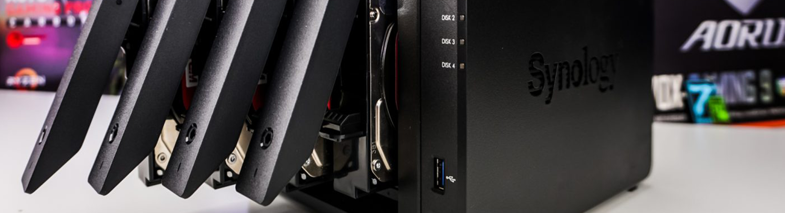

<!-- more -->

**本文介绍让群晖NAS系统添加新的硬盘**
群晖系统已经安装好，在装有硬盘的情况下，怎么添加新的硬盘？
# 1 添加硬盘到Synology
**关于群晖是否支持热拔，查了一下应该是根据具体型号的不同而不同，但是我个人觉得，都在更换硬盘了，为了安全起见，不要在意这关机开机的几分钟，群晖对于QNAP来说，开机关机的速度已经非常快了。**
以下引用[群晖官网指南](https://www.synology.com/zh-cn/knowledgebase/DSM/help/DSM/StorageManager/storage_pool_expand_add_disk)：

```
若要添加硬盘到存储池：
1.关闭 Synology NAS。（如果 Synology NAS 支持热交换，可跳过此步骤。）
2.将新硬盘安装到空置的硬盘插槽。
注：为了避免伤及自身或损坏 Synology NAS，请按 Synology 产品硬件安装指南中的硬盘安装说明进行操作。
3.打开 Synology NAS 并启动存储管理器。
4.选择您要扩充的存储池。然后在操作下拉菜单中单击添加硬盘。
5.选择要用于扩充存储池的硬盘。
6.按照设置向导的步骤完成操作。
```
# 2 设置硬件
**2.1 拔出插槽**
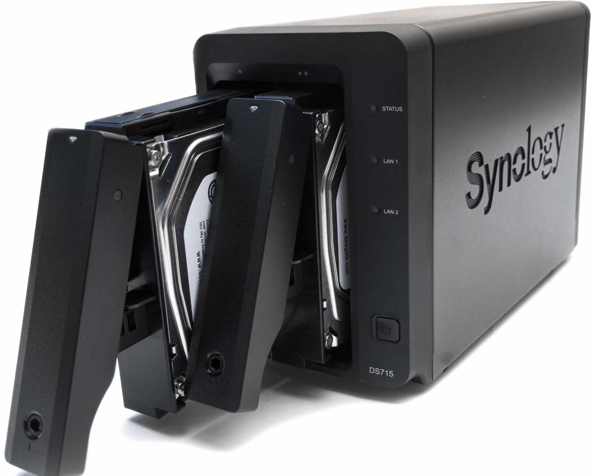
**2.2 拧上螺丝**
3.5的硬盘直接用卡扣卡住就行，非常的方便，2.5的硬盘稍微麻烦一点，你需要把两侧的卡扣取下来，然后保存好，万一以后要用到，然后将2.5的硬盘后面的四颗螺丝拧上就行。（这里的四颗硬盘螺丝得自备）
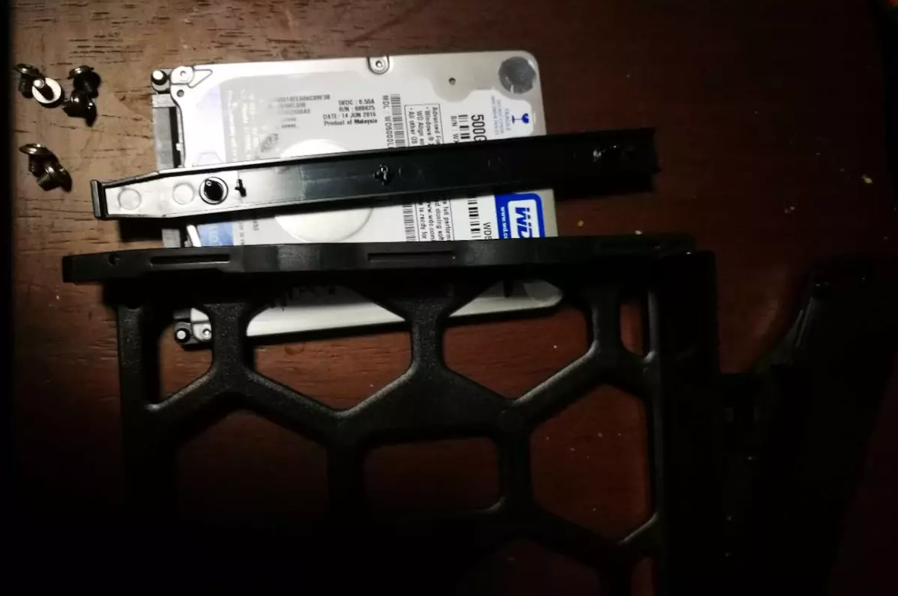
2.5的硬盘应该不会误装，就一面有孔，安上之后，往NAS里面怼进去就行。
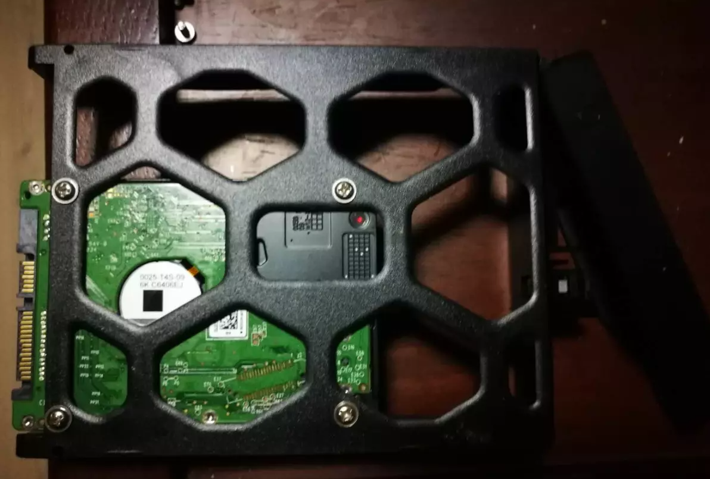

# 3 设置软件
1.打开设置页面
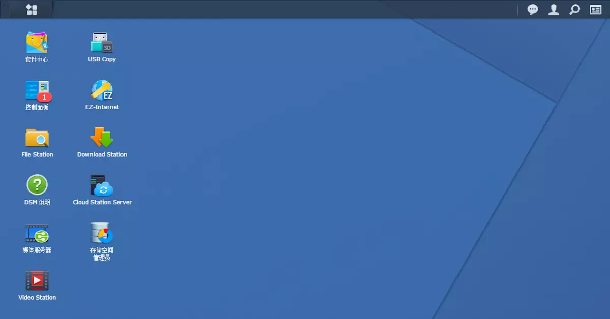
2.打开“存储空间管理员”
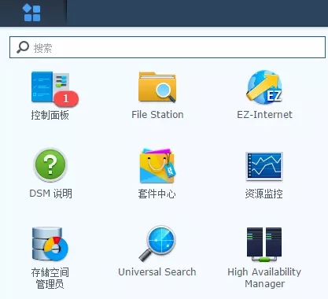
3.蓝色的是以前添加好的，第四块绿色是刚刚添加的。这个状态硬盘的空间还不能使用。
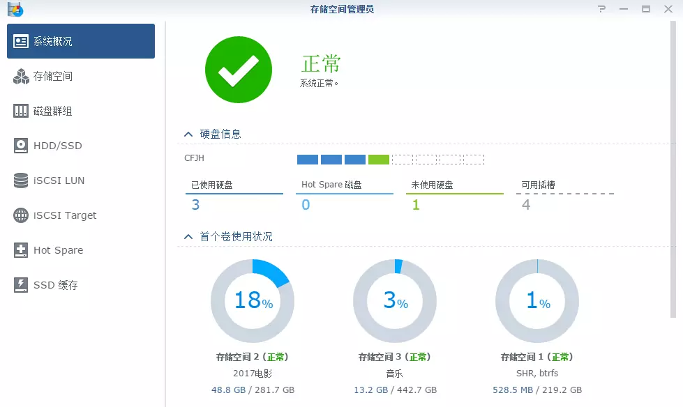
4.单击“存储空间”菜单，单击“新增”按钮
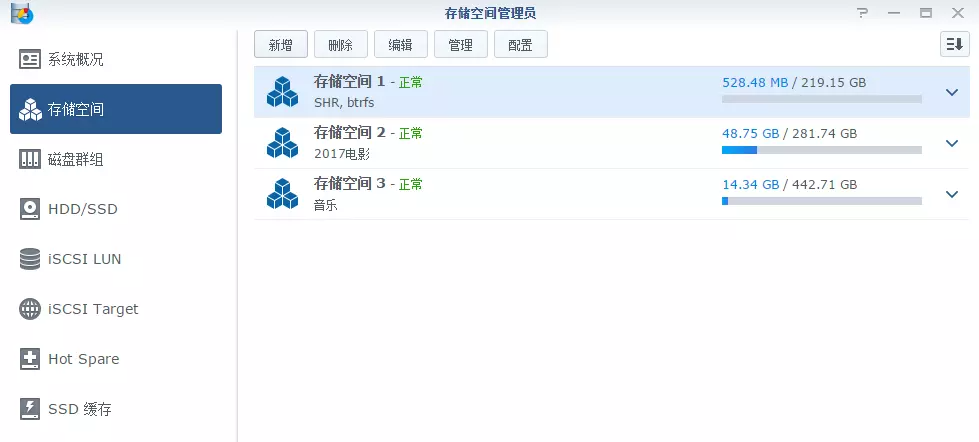
5.使用“快速”单击“下一步”
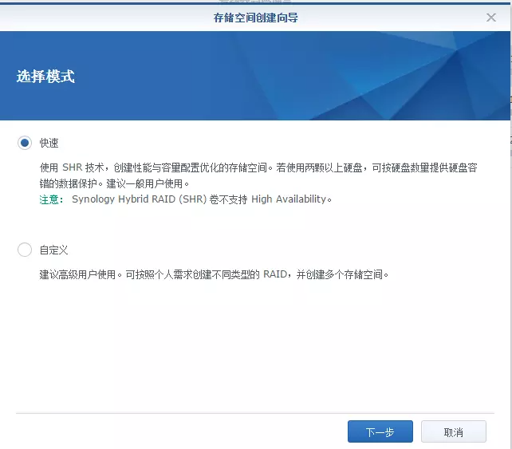
6.增加单块硬盘没有更多的选择，单击“下一步”
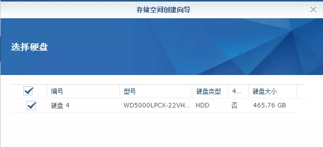
7.警告窗口告诉我们，原来硬盘上的内容都会被清除。因为硬盘的格式与WINDOWS下是不同的。

8.硬盘检查的步骤我是跳过的，选择“否”单击下一步
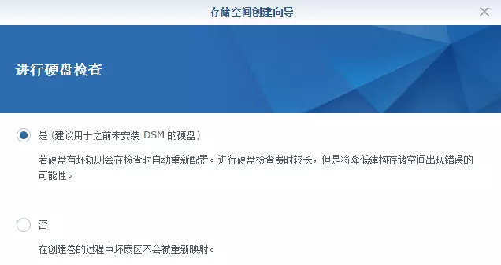
9.文件系统选择“Btrfs”，单击下一步
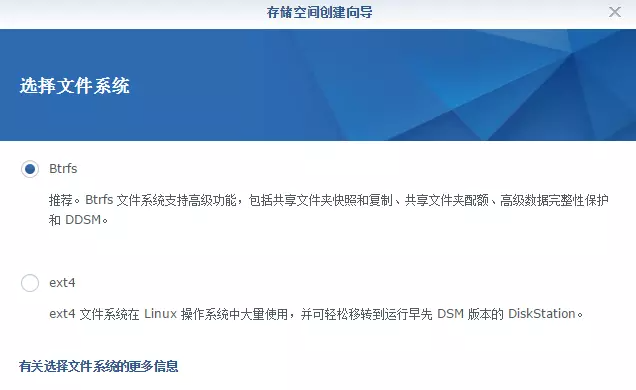
10.“编辑描述”相当于给硬盘写一个方便识别的名称，比如“古典音乐”，单击下一步
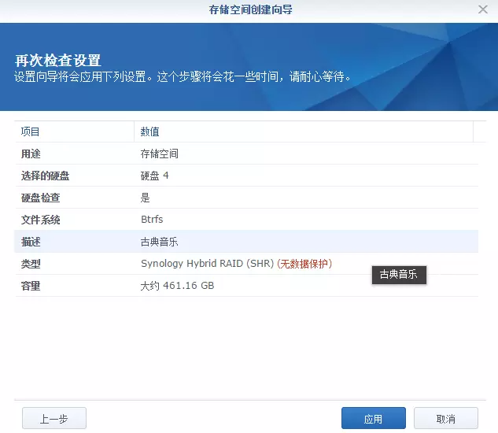
11.单击应用按钮，运行片刻后显示这样的表示硬盘已经添加成功
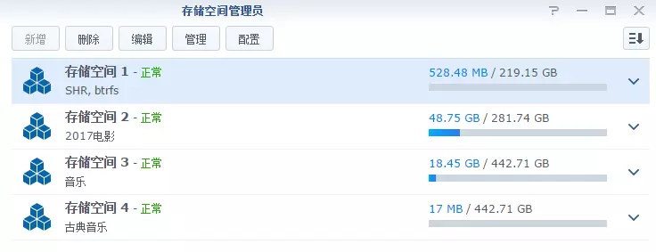
从图片上可以看出，四块硬盘大小可以不同，尺寸也可以不同，支持混用。

# 4 使用
经过这样的操作，硬盘的空间还不能被访问。最后只需要在创建共享文件夹就可以了。


