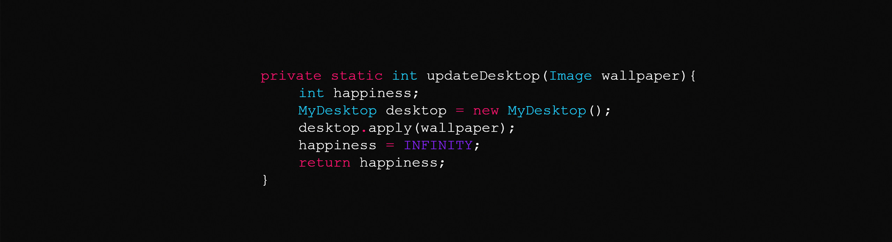

<!-- more -->

**本文列举最基本的Python语法来给你做入门的自我检测**

**入门Python，从敲出你的第一个hello world开始，但是往往学着枯燥的语法，慢慢的就不了了之，就像你立志要刷完一本英语单词本，到最后却还是只记得abandon一样，但其实无论是学任何语言，比如英语，还是学计算机语言，比如Python，都是躲不过语法的，语法是框架，是规则，有了框架的基础上才会渐渐地有血有肉，我自认为学习英语语法的好方法是自己多动手写英语文章，用更多的句式，这样自然而言语法就能烂熟于心，当然延伸到学习Python，也是一样，最好的方法自然是你需要什么，如果你都不知道你要拿Python来做什么，那么这样学习起来是很枯燥的，自然这也会导致最后你的学习之旅半路就停下了，比如我当时学习Python的第一个小项目就是写了一个爬虫，爬了一个网站所有的我需要的信息，在这个过程中用到了Python的很多种语法，这个正反馈的过程中，不但你能受到激励不容易放弃，你也会对各种语法知识更加的印象深刻。**

**这篇博文，我会列举一些最最基本的Python语法的问题，作为你想学习Python的一个自我检测吧，如果这些你都知道了，那么其实你已经是入门了Python了。**

-------

# 1. 关于标识符、关键字

* 	什么是标识符及标识符的命名规则
* 	列举不少于十种关键字
```python
if/else/elif/break/continue/for/while/and/or/not/in/True/False/try/except/finally/as/import/from/def/class/return/None/global/lambda
```
*  如何知道所有的关键字
```python
import keyword
keyword.kwlist
```

​	

# 2. 关于变量、输入、输出

* 什么是变量，变量的本质是存储还是**引用**
* 如何交换两个变量的值

```python
a = 4
b = 5

c = a   #交换两个变量的第1种方法
a = b
b = c

a = a+b   #交换两个变量的第2种方法
b = a-b
a = a-b

a,b = b,a  #交换两个变量的第3种方法
```
* python3的输入注意

```python
	a = input()    #python2
	#3+4----->a = 7 #number
	raw_input()
	a = input()    #python3
	#3+4 ---->a = "3+4" #str
```
* 对于各种数据类型的转换
```python
	#100--->a = "100"
	int("100")--->100
	str(100)---->"100"
	33670--->str(33670)--->"33670"--->len("33670")--->5
```

# 3. 字符串、列表、元组、字典、集合、列表生成式、类型转换

* 什么是字符串，切片，怎么倒转字符串
```python
a = "abcd"
a[:3]---->"abc"
a[::-1]---->"dcba"
```
* 列表的增删改查
* 元组的只读
* 字典与集合
* 什么时候用列表，什么时候用字典，字典的key需要不可变类型，不可哈希

```python
[1,2,3,1,1,1]--->增删改查

(1,2,3,1,1,1)-->只读

{1,2,3,1,1,1}---->{1,2,3} 集合---元素不重复

字典---->{key:value, key2:value}

["aa","ddd"]

{"name":"asdf","age":10}

[{"name":"xxx","family":[{"小姑":"aa","family":["a","b","cc"]},"bb","ccc"]},{},{}]

```
* 可变类型/不可变类型
```python
可变类型：列表、字典、集合
不可变类型：数字、字符串、元组
```
* 列表去重的方法

```python
a = [111,22,33,1,111,111,111,343]
b = set(a)
c = list(b)
d = tuple(a)

"a"+"b"---->"ab"
```

# 4. 切片

顺序、选择、循环

# 5. if语句

```python
if 条件:
		xxxx


if 条件:
	xxxx
else:
	xxxx2


if 条件1:
	xxx1
elif 条件2:
	xxx2:
elif 条件3:
	xxxx3
	.....
else:
	xxxx


if xxx:
	xxx
	xxx
	xx
	if yyy:
		yyyyy1

```

# 6. while语句

```python
i = 0
while i<100:
	xxxx
	xxx
	xxx
	i+=1

i = 100
while i>0:
	print(i)
	i-=1

while True:
	pass


while xxx:
	while yyy:
		pass
```

# 7. for

* 一般什么情况用for循环 

```python
a = [111,22,33]     
	for i in a:
		xxxxx               #遍历
		
```
**思考：在执行的时候i能改值吗	？**


# 8. 各种嵌套

# 9. 函数、参数、返回值、全局/局部变量、多个return、一个return返回多个值

* 什么是函数
* 参数分为实参，和形参
* 什么叫缺省参数 
	xxx(实参)


```python
结束一个函数:return
	结束一个循环:break/continue
	结束一个程序:exit()


def test(a,b,c=100,*args,**kwargs):
	pass

test(b=11,a=22,100,200,300,400,mm=100,nn=20)


num = 100
def test():
	global num
	num=200

```

​	

# 10. 类、对象

类的作用，再次封装

```python
class Animal(父类):

		类属性
		num = 100
		
		实例方法
		def __init__(self):
			self.xxx = 100 实例属性
			父类名字.父类方法(self)
			super().父类的方法名()
			super(当前类的名字Animal,self).父类的方法名()
		
		实例方法
		def tset(self):
			Animal.num = 300

		类方法
		@classmethod
		def xxx(cls):
			cls.num = 200

		静态方法
		@staticmethod
		def yyy():
			pass


	a = Animal()
	b = a

	del a----->不会调用__del__
	del b----->调用__del__方法
```


# 11. 异常


```python
try:

		xxxx

	except 异常的名字:
		异常的处理。。。。
	else:
		没有异常的时候执行
	finally:
		不管有没有产生异常，都会执行
```

# 12. 模块、包

模块和包的区别


```python
import 模块、包xxxx
	xxxx.功能()

from 模块 import test1,test2
	test1()

from .... import *


if __name__ =="__main__":
	xxx
```


