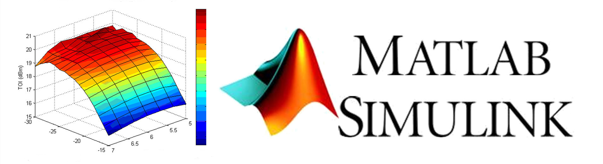
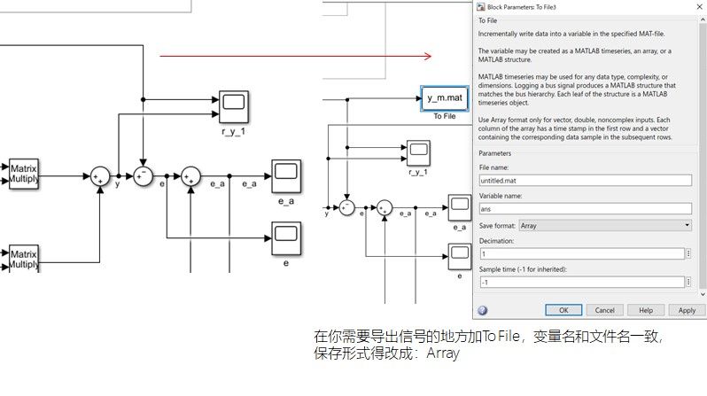
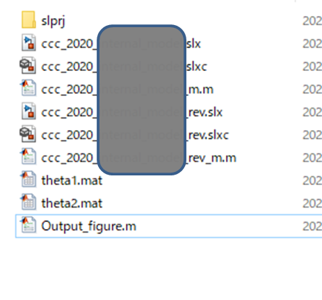

<!-- more -->

**本文将以代码的形式快速介绍MATLAB导出图到Paper**

# 1 从simulation导出数



# 2 与simulation同源文件夹下创建导图m文件




**代码如下：**

```matlab
%実験後のデータ処理用M-ファイル
% clear all           %ワークスペースクリア
% close all　　　　　　%figureウインドを閉じる
% load adp.mat     %matファイルをワークスペースに読み込み

%%%%%%%全体のフォント設定%%%%%%%%%%%%%%%%%%%%%%

set(0,'defaultAxesFontSize',15);
set(0,'defaultAxesFontName','Times New Roman');
set(0,'defaultTextFontsize',15);
set(0,'defaultTextFontName','Times New Roman');
set(0,'DefaultAxesLinewidth',1.5);

%%%%%%%図の作成%%%%%%%%%%%%%%%%%%%%%%%%%%%%%%%
load y.mat;
load y_m.mat;
load u.mat;
load k.mat;
load theta.mat;

S=get(0,'ScreenSize');
%%
%出力
figure('Position',[0 S(4)/3 1.618*S(3)/3 S(3)/3])   %図のサイズ（縦横黄金比）、表示位置
X=0:sampletime:time;
x=1:1:length(X);

plot(X,y(2,x),'r','Linewidth',1.5);  %グラフの描写（Ecxelでいう散布図形式）
%plot(x軸の値 , y軸の値　, '線の色'　, 線の太さ)
%   1:A:Bの意味　１からBまでA個おき
%   'b--'の意味　青色の破線　（このほかには'b','r','k','g'など）

hold on;    %描写を保持（これをしないと次の描写で消えてしまう）
grid on;    %目盛りの表示

plot(X,y_m(2,x),'b--','Linewidth',1.2); 
hold on;    
grid on;    

ylabel('Output','FontSize',20) %y軸のタイトル
xlabel('Time [sec]','FontSize',20)          %x軸のタイトル

legend('\sly\rm(\slt\rm)','\sly_{m}\rm(\slt\rm)','Location','northeast') %凡例
% %legend('1本目の名前','2本目の名前','Location','凡例の表示位置')
% set(legend,'FontSize',20);%フォントのサイズの変更

axis([0 100 0 4.5]);        %表示範囲の指定
%axis([x軸最小値　x軸最大値　y軸最小値　y軸最大値])

saveas(gcf,'output_y.eps','epsc')
saveas(gcf,'output_y.emf','meta')
saveas(gcf,'output_y.jpg','jpg')
%%
%input
figure('Position',[0 S(4)/3 1.618*S(3)/3 S(3)/3])   %図のサイズ（縦横黄金比）、表示位置
X=0:sampletime:time;
x=1:1:length(X);

plot(X,u(2,x),'b','Linewidth',1.5);  %グラフの描写（Ecxelでいう散布図形式）
%plot(x軸の値 , y軸の値　, '線の色'　, 線の太さ)
%   1:A:Bの意味　１からBまでA個おき
%   'b--'の意味　青色の破線　（このほかには'b','r','k','g'など）

hold on;    %描写を保持（これをしないと次の描写で消えてしまう）
grid on;    %目盛りの表示 

ylabel('Input','FontSize',20) %y軸のタイトル
xlabel('Time [sec]','FontSize',20)          %x軸のタイトル

legend('\sly\rm(\slt\rm)','\sly_{m}\rm(\slt\rm)','Location','northeast') %凡例
% %legend('1本目の名前','2本目の名前','Location','凡例の表示位置')
% set(legend,'FontSize',20);%フォントのサイズの変更

axis([0 100 -2.5 2]);        %表示範囲の指定
%axis([x軸最小値　x軸最大値　y軸最小値　y軸最大値])

saveas(gcf,'input.eps','epsc')
saveas(gcf,'input.emf','meta')
saveas(gcf,'input.jpg','jpg')
%%
%k
figure('Position',[0 S(4)/3 1.618*S(3)/3 S(3)/3])   %図のサイズ（縦横黄金比）、表示位置
X=0:sampletime:time;
x=1:1:length(X);

plot(X,k(2,x),'b','Linewidth',1.5);  %グラフの描写（Ecxelでいう散布図形式）
%plot(x軸の値 , y軸の値　, '線の色'　, 線の太さ)
%   1:A:Bの意味　１からBまでA個おき
%   'b--'の意味　青色の破線　（このほかには'b','r','k','g'など）

hold on;    %描写を保持（これをしないと次の描写で消えてしまう）
grid on;    %目盛りの表示 

ylabel('k(t)','FontSize',20) %y軸のタイトル
xlabel('Time [sec]','FontSize',20)          %x軸のタイトル

legend('\sly\rm(\slt\rm)','\sly_{m}\rm(\slt\rm)','Location','northeast') %凡例
% %legend('1本目の名前','2本目の名前','Location','凡例の表示位置')
% set(legend,'FontSize',20);%フォントのサイズの変更

axis([0 100 0 2000]);        %表示範囲の指定
%axis([x軸最小値　x軸最大値　y軸最小値　y軸最大値])

saveas(gcf,'k.eps','epsc')
saveas(gcf,'k.emf','meta')
saveas(gcf,'k.jpg','jpg')
%%
%theta
figure('Position',[0 S(4)/3 1.618*S(3)/3 S(3)/3])   %図のサイズ（縦横黄金比）、表示位置
X=0:sampletime:time;
x=1:1:length(X);

plot(X,theta(2,x),'b','Linewidth',1.5);  %グラフの描写（Ecxelでいう散布図形式）
%plot(x軸の値 , y軸の値　, '線の色'　, 線の太さ)
%   1:A:Bの意味　１からBまでA個おき
%   'b--'の意味　青色の破線　（このほかには'b','r','k','g'など）

hold on;    %描写を保持（これをしないと次の描写で消えてしまう）
grid on;    %目盛りの表示 

ylabel(' \theta','FontSize',20) %y軸のタイトル
xlabel('Time [sec]','FontSize',20)          %x軸のタイトル

legend('\sly\rm(\slt\rm)','\sly_{m}\rm(\slt\rm)','Location','northeast') %凡例
% %legend('1本目の名前','2本目の名前','Location','凡例の表示位置')
% set(legend,'FontSize',20);%フォントのサイズの変更

axis([0 100 -40 60]);        %表示範囲の指定
%axis([x軸最小値　x軸最大値　y軸最小値　y軸最大値])

saveas(gcf,'theta.eps','epsc')
saveas(gcf,'theta.emf','meta')
saveas(gcf,'theta.jpg','jpg')
```

# Note

- ***在simulation运行之后，同源文件夹内才会产生`To File`的`.mat`文件，这个时候才能运行导图m文件。**

